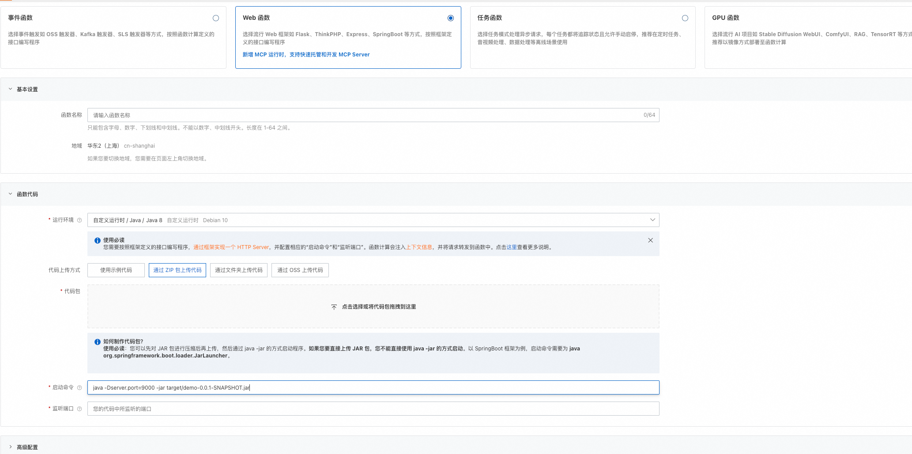

# 快速开始

本文档将帮助您快速上手 VodAppServer，完成从安装到第一个 API 调用的全过程。

⚠️ **重要提醒**：调用 VOD 的实体类和播单类接口需要提交工单进行加白后才可以使用。

## 目录

- [5分钟快速体验](#5分钟快速体验)
- [部署到阿里云函数计算](#部署到阿里云函数计算)
- [核心概念](#核心概念)
- [典型场景](#典型场景)
- [接口变更说明](#接口变更说明)

---

## 5分钟快速体验

### 步骤 1：克隆项目

```bash
git clone https://github.com/MediaBox-Demos/VodAppServer.git
cd VodAppServer
```

### 步骤 2：配置密钥和地域

编辑 `src/main/resources/application.yml`：

```yaml
server:
  port: 9000

aliyun:
  vod:
    ak: YOUR_ACCESS_KEY_ID      # 阿里云 AccessKey ID
    sk: YOUR_ACCESS_KEY_SECRET  # 阿里云 AccessKey Secret
    region: cn-shanghai         # 地域标识（必须与 VOD 控制台开通区域一致）
```

**快速配置说明**：
- `ak` / `sk`：从 [阿里云 RAM 控制台](https://ram.console.aliyun.com/manage/ak) 获取
- `region`：根据 VOD 服务开通区域选择（cn-shanghai / cn-beijing / cn-shenzhen / ap-southeast-1）

> 💡 **详细配置说明**：包括地域选择指南、环境变量配置、安全建议等，请参考 [集成指引 - 配置文件设置](./Integration-Guide.md#1-配置文件设置)

### 步骤 3：启动服务

```bash
mvn spring-boot:run
```

看到以下日志表示启动成功：
```
VOD 客户端初始化成功，Region: cn-shanghai
Started Application in 5.234 seconds
```

**验证 Region 配置**：
- 启动日志中显示的 Region 应该与您在 `application.yml` 中配置的 `region` 一致
- 如果配置错误，可能导致 VOD API 调用失败

### 步骤 4：测试第一个接口

```bash
# 获取播单列表
curl -X POST http://localhost:9000/appServer/getPlaylists \
  -H "Content-Type: application/json" \
  -d '{"pageNo":"1","pageSize":"10"}'
```

✅ 成功！您已完成第一次调用。

---

## 部署到阿里云函数计算

阿里云函数计算（FC）提供 Serverless 部署方式，无需管理服务器，按量计费。

### 步骤 1：构建项目

```bash
# 进入项目目录
cd VodAppServer

# Maven 打包
mvn clean package

# 打包成功后，生成 target/VodAppServer-1.0-SNAPSHOT.jar
```

### 步骤 2：准备部署包

```bash
# 创建部署目录结构
mkdir -p deploy/VodAppServer/target

# 复制 JAR 文件
cp target/VodAppServer-1.0-SNAPSHOT.jar deploy/VodAppServer/target/

# 进入部署目录
cd deploy

# 压缩成 ZIP 文件
zip -r VodAppServer.zip VodAppServer/
```

**目录结构**：
```
VodAppServer.zip
└── VodAppServer/
    └── target/
        └── VodAppServer-1.0-SNAPSHOT.jar
```

### 步骤 3：创建函数

#### 3.1 登录控制台

访问 [阿里云函数计算控制台](https://fc.console.aliyun.com)

#### 3.2 创建服务

- 点击「服务及函数」→「创建服务」
- **服务名称**：`vod-app-service`
- **地域**：选择与 VOD 服务相同的地域（如 `cn-shanghai`）
  - ⚠️ **重要**：必须与 `application.yml` 中配置的 `region` 一致
  - 如果 VOD 服务在华东2（上海），选择 `cn-shanghai`
  - 如果 VOD 服务在华北2（北京），选择 `cn-beijing`

#### 3.3 创建自定义运行时 Java 函数

在服务内点击「创建函数」，配置如下：

**基础配置**：
- **函数名称**：`vod-app-function`
- **请求处理程序类型**：✅ **Web 函数**
- **运行时**：✅ **Java 8**
- **代码上传方式**：✅ **通过 ZIP 包上传代码**



**代码配置**：

1. **上传 ZIP 包**：选择刚才创建的 `VodAppServer.zip`

2. **启动命令**：
   ```bash
   java -jar /code/VodAppServer/target/VodAppServer-1.0-SNAPSHOT.jar
   ```

**资源配置**：
- **内存规格**：`1024 MB`（或更高）
- **超时时间**：`60 秒`
- **实例并发度**：`1`（可根据需求调整）

### 步骤 4：配置环境变量


在函数配置页面，找到「环境变量」配置项，添加以下配置：

| 环境变量名 | 值 | 说明 |
|------------|-----|------|
| **ACCESS_KEY_ID** | `您的阿里云 AccessKey ID` | 阿里云 AK |
| **ACCESS_KEY_SECRET** | `您的阿里云 AccessKey Secret` | 阿里云 SK |
| **ALIYUN_VOD_REGION** | `cn-shanghai` | VOD 地域标识（与 VOD 服务区域一致） |

> 💡 **详细说明**：环境变量配置的详细说明和安全建议，请参考 [集成指引 - 使用环境变量](./Integration-Guide.md#使用环境变量推荐)

### 步骤 5：配置触发器

为函数创建 HTTP 触发器：

1. 在函数详情页，点击「触发器」→「创建触发器」
2. 选择「HTTP 触发器」
3. 认证方式：选择「匿名」或「签名认证」
4. 点击确定，生成公网访问地址

**示例访问地址**：
```
https://vod-app-function-xxx.cn-shanghai.fcapp.run
```

### 步骤 6：测试部署

使用生成的公网地址进行测试：

```bash
# 替换为您的实际地址
curl -X POST https://vod-app-function-xxx.cn-shanghai.fcapp.run/appServer/getPlaylists \
  -H "Content-Type: application/json" \
  -d '{"pageNo":"1","pageSize":"10"}'
```

✅ **成功响应说明部署完成！**

---

### 部署注意事项

#### 1. 冷启动问题

函数计算存在冷启动，首次调用可能耗时较长（5-10秒）。

**解决方案**：
- 配置预留实例（保持 1 个实例常驻）
- 路径：函数配置 → 实例伸缩 → 预留实例

#### 2. 内存优化

Java 应用内存占用较高，建议：
- 最小内存：1024 MB
- 推荐内存：2048 MB

#### 3. 日志查看

在函数详情页 → 日志查询，可以查看：
- 函数调用日志
- 应用输出日志
- 错误信息

#### 4. 性能调优

如需更好的性能：
- **增加内存**：2048 MB 或 3072 MB
- **提高并发度**：允许更多实例同时运行
- **配置预留实例**：减少冷启动时间

---

### 常见问题

**Q1：函数启动失败？**

A：检查 ZIP 包目录结构、启动命令路径、JAR 文件完整性

**Q2：环境变量未生效？**

A：确保环境变量名称正确、保存后重启函数、代码中通过 `System.getenv()` 读取

**Q3：如何更新代码？**

A：重新打包 → 创建 ZIP 包 → 上传到控制台 → 函数自动重启

> 💡 **更多问题排查**：包括启动失败、接口调用失败、跨域问题等，请参考 [集成指引 - 常见问题排查](./Integration-Guide.md#3-常见问题排查)

---

## 核心概念

在后续文档中会频繁出现以下几个概念，建议先有一个直观认识：

- **播单（Playlist）**：一组有顺序的短剧视频集合，例如「某部短剧的全集」；  
- **VOD（Video on Demand）**：阿里云视频点播服务，负责媒资存储、转码、分发和播放；  
- **PlayAuth / 播放凭证**：客户端拿着 `videoId + playAuth` 才能从 VOD 换取真实播放地址；  
- **模板组（TemplateGroup）**：媒体处理（MPS）中的转码配置集合，一次任务可产出多路清晰度。

> 更完整的接口细节，请参考 [API-Guide.md](./API-Guide.md)。

---

## 典型场景

### 场景 1：获取播单列表（短剧列表）

```bash
curl -X POST http://localhost:9000/appServer/getPlaylists \
  -H "Content-Type: application/json" \
  -d '{
    "pageNo": "1",
    "pageSize": "10",
    "sortBy": "CreationTime:Desc"
  }'
```

### 场景 2：向播单添加视频

```bash
curl -X POST http://localhost:9000/appServer/addPlaylistVideos \
  -H "Content-Type: application/json" \
  -d '{
    "playlistId": "pl_xxx",
    "preVideoId": "",
    "playlistVideos": "[{\\"VideoId\\":\\"video1\\",\\"Title\\":\\"第1集\\"}]"
  }'
```

> 更多字段说明和高级用法，请参考 [API-Guide.md](./API-Guide.md)。

---

## 常见问题

### Q1：如何获取实体 ID？

**答**：调用初始化接口后，从响应中获取（注意：部分实体管理接口已移除，详见下方接口变更说明）

### Q2：playAuth 有效期多久？

**答**：默认 3600 秒（1小时），可在生成时配置：

```java
JwtUtil.getPlayAuthToken(videoId, playKey, regionId); // 支持自定义 regionId
```

### Q3：如何处理封面图？

**答**：上传图片到 VOD 获取 `imageId`，查询时通过 `GetImageInfos` 转换为实际 URL

### Q4：删除播单会删除视频吗？

**答**：不会。只删除播单与视频的关联关系，视频媒资仍然保留。

> 💡 **配置相关问题**：如启动失败、接口调用失败等，请参考 [集成指引 - 常见问题排查](./Integration-Guide.md#3-常见问题排查)

---

## 下一步

现在您已掌握基础操作，可以：

1. 📚 查看 [API-Guide.md](./API-Guide.md) 了解完整接口
2. 🚀 探索 [Advanced-Features.md](./Advanced-Features.md) 实现复杂业务
3. 💡 参考 [Integration-Guide.md](./Integration-Guide.md) 集成到生产环境

---

## 更多资源

- **示例代码**: `/src/main/java/com/aliyun/appserver/sample/`
- **阿里云文档**: [VOD API 参考](https://help.aliyun.com/document_detail/61063.html)

---

## 接口变更说明

### 当前可用接口

当前版本仅保留以下核心接口：

1. **播单管理接口**：
   - `POST /appServer/createPlaylist` - 创建播单
   - `POST /appServer/deletePlaylists` - 删除播单
   - `POST /appServer/getPlaylist` - 获取播单详情
   - `POST /appServer/getPlaylists` - 获取播单列表
   - `POST /appServer/updatePlaylistBasicInfo` - 更新播单基本信息
   - `POST /appServer/updatePlaylistVideoBasicInfo` - 更新播单视频基本信息
   - `POST /appServer/updatePlaylistVideos` - 更新播单视频列表
   - `POST /appServer/addPlaylistVideos` - 添加播单视频
   - `POST /appServer/deletePlaylistVideos` - 删除播单视频
   - `POST /appServer/getPlaylistInfo` - 获取播单详情（业务增强）
   - `POST /appServer/getPlaylistVideos` - 获取播单列表（业务增强）

2. **媒体处理接口**：
   - `POST /submitTransCodeJob` - 提交转码任务

---

**最后更新**: 2025-11-24
