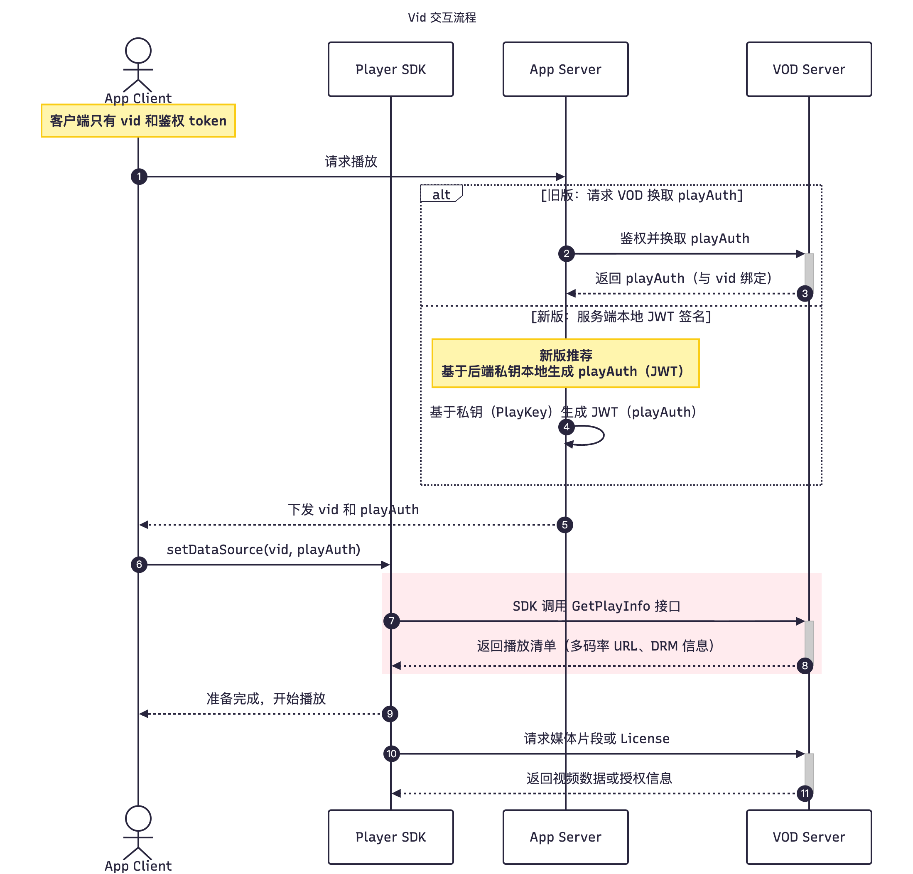
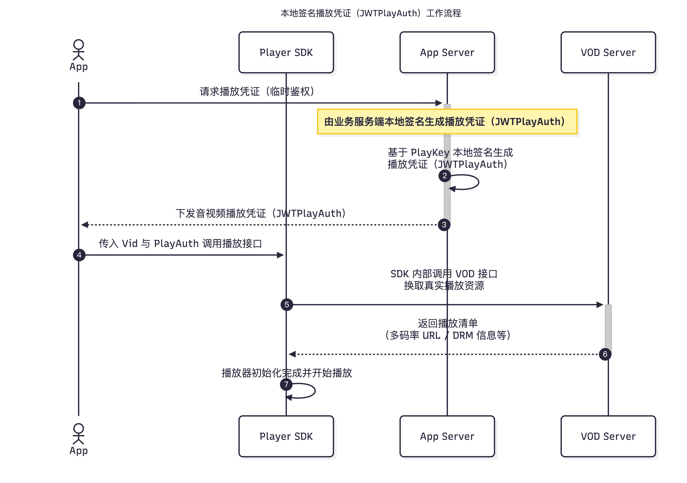
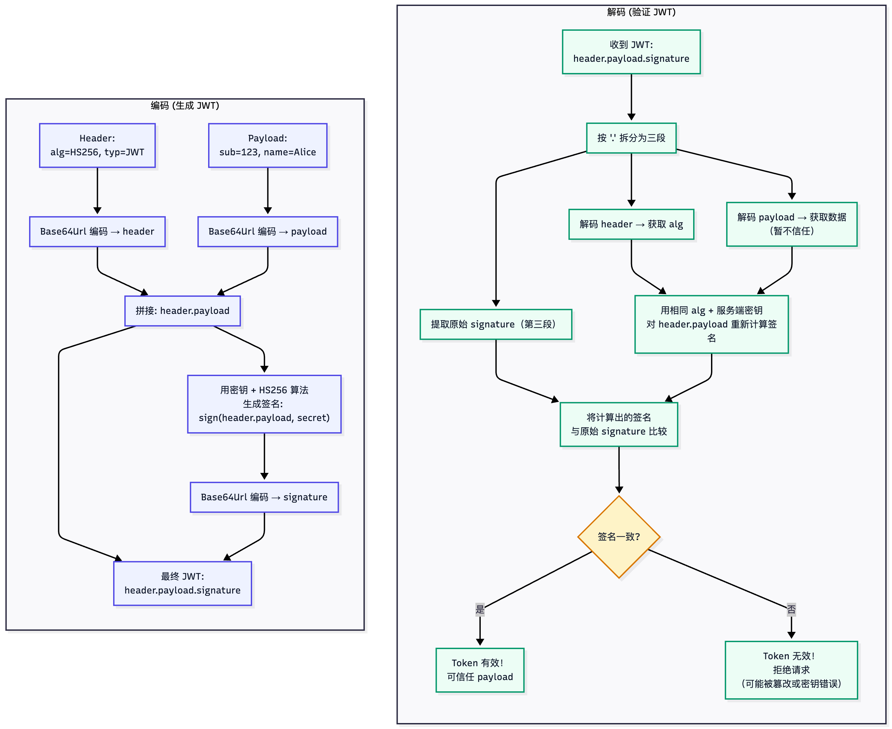
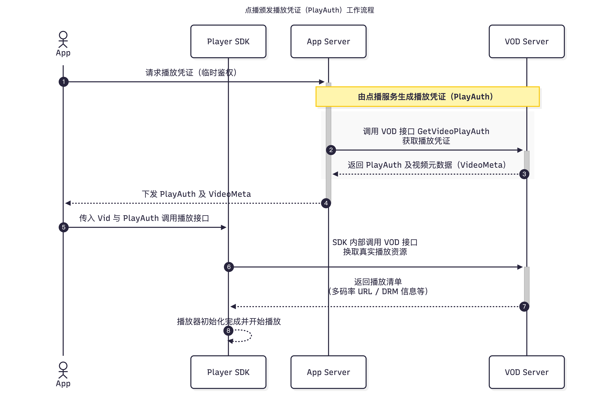

## **Vid 播放鉴权：PlayAuth 与 JWTPlayAuth 方案**

本章节面向**架构师 / 后端开发 / 客户技术同学**，用一页内容讲清楚三件事：

1. 点播颁发播放凭证（PlayAuth）的工作原理（调用 VOD 接口 `GetVideoPlayAuth` 获取）；  
2. 本地签名播放凭证（JWTPlayAuth）的工作原理（基于 PlayKey 本地 JWT 签名生成，点播校验）；  
3. 新旧方案在性能、安全性、扩展性上的核心差异，以及播放器 SDK 的版本要求。

### **术语与口径（统一）**

- **点播颁发播放凭证（PlayAuth）**：由阿里云视频点播服务签发。典型获取方式为 AppServer 调用 `GetVideoPlayAuth` 获取 PlayAuth 并下发给客户端。
- **本地签名播放凭证（JWTPlayAuth）**：由客户 AppServer 基于 PlayKey 在本地签名生成（JWT），点播服务在播放链路负责校验。
- **说明**：
  - 本文中 `vid` 等同于 `videoId`；
  - 业务返回体字段通常仍命名为 `playAuth`（历史兼容），其值在不同方案下可能是 `PlayAuth` 或 `JWTPlayAuth`。

---

### **1. 场景概览：播放凭证在 vid 播放链路中的位置**

- 播放鉴权的核心职责：**给某个 `videoId` 颁发一张“临时通行证”（播放凭证），由播放器携带 `vid + 播放凭证` 去 VOD 换取真实播放地址。**
- 区别只在于：
  - **点播颁发（PlayAuth）**：这张“通行证”由点播服务生成，AppServer 每次向点播服务获取一张；  
  - **本地签名（JWTPlayAuth）**：这张“通行证”由 AppServer 本地生成，点播服务只负责验签与时效校验。

---

### **2. 播放时序对比：PlayAuth vs JWTPlayAuth**

> 上图统一展示了 vid 播放的通用交互链路：App 请求播放 → AppServer 返回 `vid + 播放凭证` → Player SDK 携带 `vid + 播放凭证` 向 VOD 换取真实播放地址。  
> 两种方案的唯一差异在于：「AppServer 如何获得 / 生成播放凭证」，后文分别展开。

---

### **3. 本地签名播放凭证（JWTPlayAuth）**

#### **3.1 播放流程（本地签名）**

> 特点：**AppServer 持有 PlayKey，在本地直接生成 JWTPlayAuth（JWT），点播服务只做验签与时效校验。**

#### **3.2 JWT 原理示意图**

#### **3.3 一句话说明**

- AppServer 使用 **PlayKey + videoId** 在本地生成 **JWTPlayAuth（JWT）**；  
- 点播服务使用同一个 **PlayKey** 验证 JWT 的签名与过期时间；  
- AK/SK 只用于后台获取 PlayKey，本身不出现在播放链路中；  
- 过期时间可配置（默认 1 天），业务可按需收紧。

----

### **4. 点播颁发播放凭证（PlayAuth）**

#### **4.1 播放流程（点播颁发）**

> 特点：**每次播放前，AppServer 都要向点播服务调用 `GetVideoPlayAuth` 获取 PlayAuth。**

#### **4.2 PlayAuth 的生成方式**

- AppServer 调用 `GetVideoPlayAuth` 接口，将 `videoId` 和相关播放参数传给点播服务；  
- 点播服务在服务端根据配置与权限规则，生成一份临时的 PlayAuth；  
- 这份 PlayAuth 回传给 AppServer，再由 App 下发给客户端使用。

#### **4.3 一句话说明**

- AppServer 每次播放前通过 `GetVideoPlayAuth` 让点播服务生成一次性 PlayAuth（默认有效期约 3000 秒），业务方可控空间相对有限。

---

### **5. JWTPlayAuth（本地签名）相比 PlayAuth（点播颁发）的核心优势**

#### **5.1 更快、更稳定**

- PlayAuth：每次播放都要远程调用 `GetVideoPlayAuth`，多一次网络 RTT，接口耗时和失败率都受网络/服务端抖动影响。  
- JWTPlayAuth：签名在 AppServer 本地完成，播放链路只保留一次 换取真实播放资源 的接口调用，整体平均耗时更低、抖动更小。

#### **5.2 更易扩展**

- PlayAuth：高并发场景下，`GetVideoPlayAuth` QPS 直接压在点播服务接口上。  
- JWTPlayAuth：签名计算变成本地 CPU 开销，通过横向扩容 AppServer 即可线性扩展播放能力。

#### **5.3 更灵活的业务控制**

- PlayAuth：结构与生成逻辑封装在点播服务内部，可调参数有限。  
- JWTPlayAuth：是标准 JWT，可按需增加用户 ID、设备 ID、IP/地域限制、风控标签等 Claim，并自定义过期时间与策略。

#### **5.4 更清晰的安全边界**

- JWTPlayAuth 仅在后台用 AK/SK 获取 PlayKey，播放链路只暴露 `vid + JWTPlayAuth`，不直接暴露 AK/SK，也不依赖 STS，安全面更收敛。  

#### **5.5 与新版 Player SDK 的能力对齐**

- 本地签名方案依赖播放器 SDK 对 `vid + JWTPlayAuth` 的内建支持能力；  
- **客户端播放器 SDK 版本要求**：

> 使用本地签名播放凭证 `vid + JWTPlayAuth`（字段名通常为 `playAuth`）进行播放时，  
> 客户端播放器 SDK 版本需要 **≥ 7.10.0**，否则无法完成播放鉴权。

---

### **6. 与源码的对应关系（方便二次开发快速定位）**

- `jwt/JwtConstants.java`  
  - 定义了 `DEFAULT_APP_ID`、`DEFAULT_REGION_ID`、`EXPIRED_TIME_MILLS` 等 JWTPlayAuth 相关常量；  
  - 可以在这里调整默认过期时间等基础配置。

- `jwt/JwtUtil.java`  
  - 提供 `getPlayAuthToken(String videoId, String playKey)` 方法，用于基于 PlayKey 生成 JWTPlayAuth；  
  - 顶部注释中已注明“仅服务端调用 + Player SDK 版本要求”等注意事项。

- `service/impl/PlayListServiceImpl.java`  
  - 在 `getPlaylistInfo`、`getPlaylistVideos` 等方法中调用 `JwtUtil.getPlayAuthToken(...)`，为短剧视频生成 JWTPlayAuth（字段名为 `playAuth`）；  
  - 是本 Demo 中“如何将本地签名集成到实际业务返回体”的直接示例。

-----

